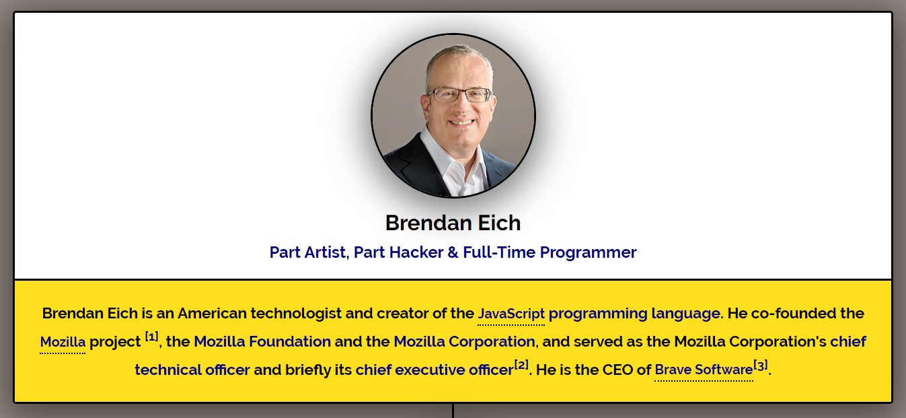
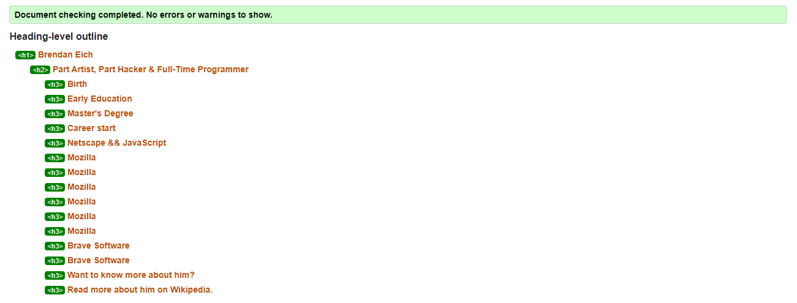
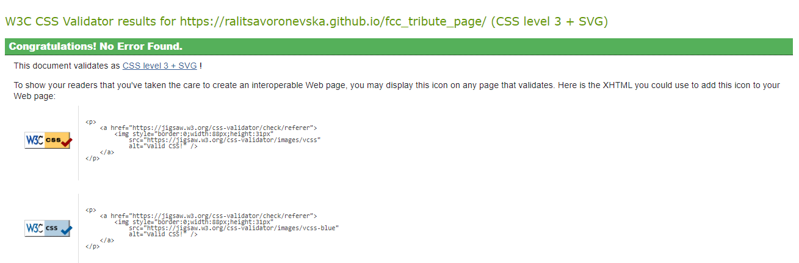
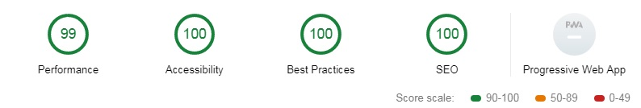
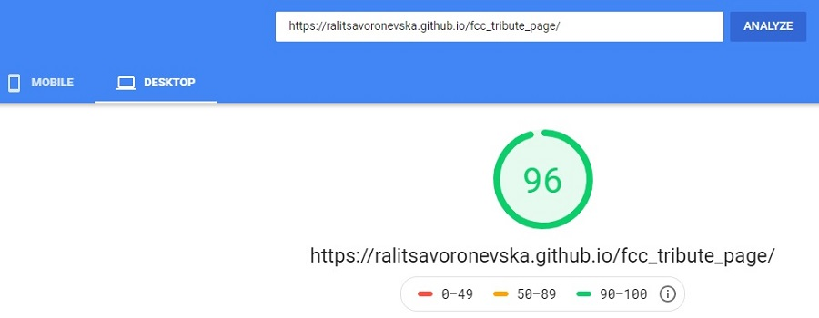
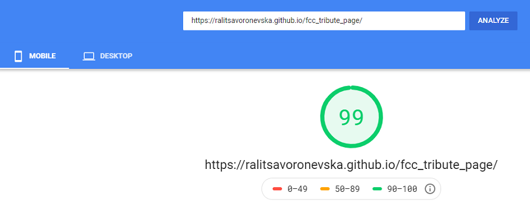

# 🚀 FCC: Build a Tribute Page

📝 [CodePen](https://codepen.io/ralitsavoronevska/pen/zVOaXb/)
🔗[Live GitHub Preview](https://ralitsavoronevska.github.io/fcc_tribute_page/)

🎯 FreeCodeCamp Requirements

##  Responsive Web Design Projects - Build a Tribute Page

Objective: Build a CodePen.io app that is functionally similar to this: https://codepen.io/freeCodeCamp/full/zNqgVx. Do not copy this demo project.

Fulfill the below user stories and get all of the tests to pass. Give it your own personal style.

> You can use HTML, JavaScript, and CSS to complete this project. Plain CSS is recommended because that is what the lessons have covered so far and you should get some practice with plain CSS. You can use Bootstrap or SASS if you choose. Additional technologies (just for example jQuery, React, Angular, or Vue) are not recommended for this project, and using them is at your own risk. Other projects will give you a chance to work with different technology stacks like React. We will accept and try to fix all issue reports that use the suggested technology stack for this project. Happy coding!

🆔 User Story #1: My tribute page should have an element with a corresponding id="main", which contains all other elements.                                                 
🔠 User Story #2: I should see an element with a corresponding id="title", which contains a string (i.e. text) that describes the subject of the tribute page (e.g. "Dr. Norman Borlaug").                                                                                                                                                           
🔡 User Story #3: I should see a div element with a corresponding id="img-div".                                                                                             
🖼️ User Story #4: Within the img-div element, I should see an img element with a corresponding id="image".                                                                 
🔤 User Story #5: Within the img-div element, I should see an element with a corresponding id="img-caption" that contains textual content describing the image shown in img-div.                                                                                                                                                                    
🆔 User Story #6: I should see an element with a corresponding id="tribute-info", which contains textual content describing the subject of the tribute page.                
🔗 User Story #7: I should see an a element with a corresponding id="tribute-link", which links to an outside site that contains additional information about the subject of the tribute page. HINT: You must give your element an attribute of target and set it to _blank in order for your link to open in a new tab (i.e. target="_blank").       
📱 User Story #8: The img element should responsively resize, relative to the width of its parent element, without exceeding its original size.                             
🔛 User Story #9: The img element should be centered within its parent element.                                                                                             

You can build your project by forking this [CodePen pen](https://codepen.io/freeCodeCamp/pen/MJjpwO/).
Or you can use this CDN link to run the tests in any environment you like:
https://cdn.freecodecamp.org/testable-projects-fcc/v1/bundle.js.
Once you're done, submit the URL to your working project with all its tests passing.
Remember to use the [Read-Search-Ask](https://www.freecodecamp.org/forum/t/how-to-get-help-when-you-are-stuck/19514/) method if you get stuck.

📸 Screenshots

## 🖥️ Desktop preview

<table width="100%">
  <thead>
    <tr>
      <th width="50%" style="border: none;">📱 Tablet Preview</th>
      <th width="50%" style="border: none;">📱 Mobile Preview</th>
    </tr>
  </thead>
  <tbody>
    <tr>
      <td width="50%"></td>
      <td width="50%"></td>
    </tr>
  </tbody>
</table>

# 🏅 W3C HTML Validator

# 🏅 W3C CSS Validator

# 🌈 Chrome LightHouse Audit
* Desktop & Mobile:

# ⚡ PageSpeed Insights Results
* Desktop:

* Mobile:

          

                                                                                                                                                                       

# 🛠️ Built with:
 
                                                                                      
                                                                                                                            
🧩 SCSS Files [Responsiveness, Transitions & Flex Layout]                                                                                                                   
🧩 [AOS Library v2.3.4](https://github.com/michalsnik/aos/tree/v2/)                                                                                                         
🧩 [Google Font: Raleway](https://fonts.google.com/specimen/Raleway/)                                                                                                       
🧩 [Bootstrap v5.3](https://getbootstrap.com/docs/5.3/getting-started/introduction/)                                                                                        
🧩 [Bootstrap v5.3 Icons](https://icons.getbootstrap.com/)                                                                                                                  

# ✨ Features:
✅ Brendan Eich's full Wikipedia biography showcased the modern way     
✅ Responsive Web Design implemented by using media queries                                                                                                 
✅ Transitioning Timeline Cards which hide/show on scroll                                                                                                                
✅ References to Brendan Eich's Wikipedia Page                                                                                                                              
✅ On hover smootly animated svg tooltips                                                                                                                                   
✅ Custom-styled Mr. Eich's Famous Quote                                                                                                                              
✅ Related Social and Info Links                                                                                                                
✅ robots.txt                                                                                                                                                               
✅ sitemap.xml                                                                                                                                                              
✅ manifest.json                                                                                                                                                            
✅ service-worker.js                                                                                                                                                         

# 🧰 Online resources and tools:
                       
🖼️ [Photopea [Online Photo Editor]](https://www.photopea.com/)                                                                         
🪄 [svg-to-png & svg minification](https://www.svgviewer.dev/svg-to-png/)                                                               

# 🌐 Browser Support:
☑️ Last updated and tested: 25/07/2025                                                                                                                                     
🌟 Chrome 138.0.7204.169 (64-bit)                                                                                                                                           
🦊 Firefox 141.0 (64-bit)                                                                                                                                                   
🏴‍☠️ Opera 120.0.5543.93 (64-bit)                                                                                                                                          
🪟 Edge 138.0.3351.95 (64-bit)                                                                                                                                              

# 🧪 Online Validators:
✔️ [W3C HTML Validator](https://validator.w3.org/)                                                                                                                          
✔️ [W3C CSS Validator](https://jigsaw.w3.org/css-validator/)                                                                                                                
💡 [LightHouse Audit](https://developers.google.com/web/tools/lighthouse/)                                                                                                  
⚡ [PageSpeed Insights Audit](https://pagespeed.web.dev/)                                                                                                                   

# 🌟 Inspiration & Credits
📝 https://codepen.io/itshally/pen/mzrOrx                                                                                                                                   
📝 https://codepen.io/completejavascript/pen/baOYpa                                                                                                                         
📝 https://codepen.io/davi3blu3/pen/Vegobo                                                                                                                                  
🎞️ [Fadein and Fadeout Back To Top Button on Page Scroll using CSS and Vanilla JS [YouTube]](https://youtu.be/Pd71ZZeIhaI/)                                                                                                        
🎞️ [Animate On Scroll Webpage | AOS Library [YouTube]](https://www.youtube.com/watch?v=ptfUwPJbGlQ/)                                                                                                                              
📝 [Animate On Scroll Webpage | AOS Library [CodePen]](https://codepen.io/bradtraversy/pen/bGbREWg/)                                                                        

---
  
🙌 Thanks for checking out my project! More is coming 🔜.                                                                                                                  
Stay tuned 🚀 and don't forget to give the project a star! ⭐                                                                                                              
Made with lots of 💗, ☕, and a sprinkle of ✨ by Ralitsa Taylor!                                                                                                          